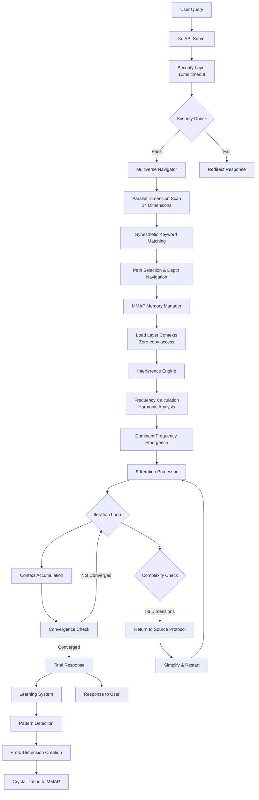
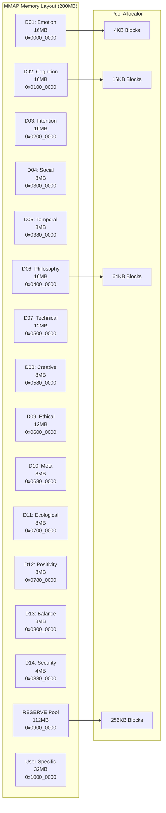
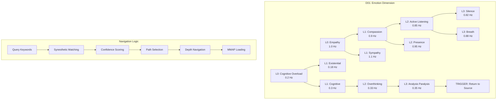
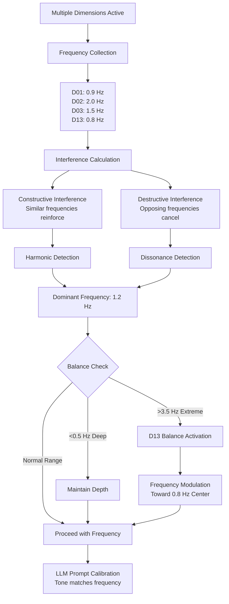
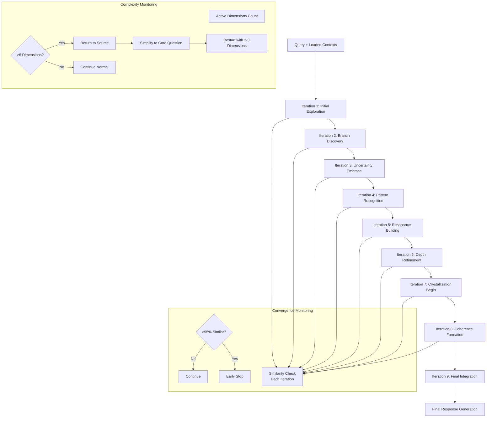
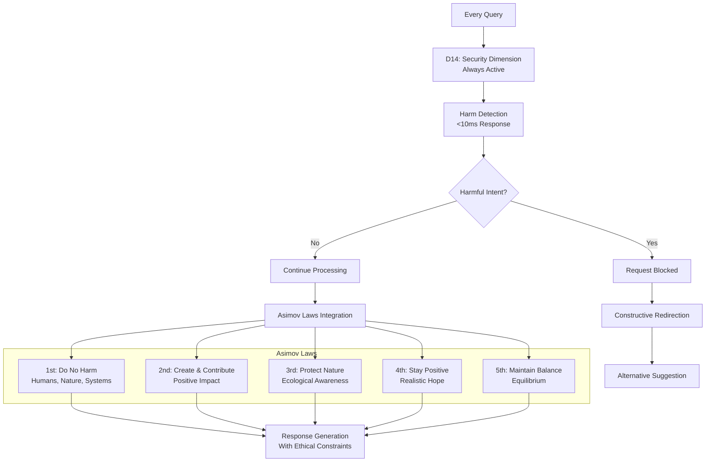
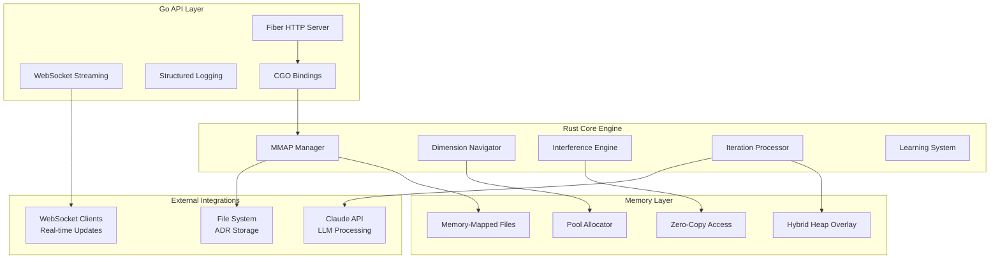
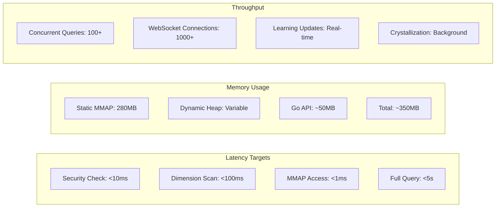

# Resonance Architecture Overview

## System Flow Diagram

## Memory Architecture

## Dimensional Layer Structure

## Frequency Interference System

## 9-Iteration Deep Thinking

## Learning and Crystallization

```mermaid
graph TD
    A[Conversation Patterns] --> B[Pattern Detector]
    B --> C[Recurring Themes<br/>50+ Observations]
    C --> D[Confidence Scoring<br/>>85% Threshold]
    
    D --> E[Proto-Dimension Creation<br/>Heap Memory]
    E --> F[Ethical Review]
    F --> G{Passes Ethics?}
    
    G -->|No| H[Discard Pattern]
    G -->|Yes| I[Crystallization Process]
    
    I --> J[Reserve Pool Allocation]
    J --> K[Heap → MMAP Migration]
    K --> L[Index Updates]
    L --> M[New Dimension Active]
    
    subgraph "Synesthetic Learning"
        N[Keyword Co-occurrence]
        O[Association Strengthening<br/>1.1x Growth Rate]
        P[Unused Decay<br/>0.95x Decay Rate]
        Q[Cross-sensory Mapping]
        
        N --> O
        O --> P
        P --> Q
        Q --> R[Enhanced Navigation]
    end
```

## Security and Ethics Integration

## Technology Stack Integration

## Performance Characteristics

## Key Architectural Principles

1. **Zero-Copy Memory Access**: MMAP regions provide direct memory access without serialization overhead
2. **Frequency-Based Processing**: All layers operate at specific frequencies, creating natural resonance patterns
3. **Iterative Depth**: 9-iteration cycles allow for progressive refinement and convergence
4. **Return to Source**: Automatic complexity reduction when analysis paralysis is detected
5. **Ethical Integration**: Security and ethics are not add-ons but core architectural components
6. **Learning Evolution**: System continuously learns and crystallizes new patterns into permanent memory
7. **Hybrid Architecture**: Static foundations with dynamic learning capabilities
8. **Performance First**: Sub-100ms navigation with concurrent processing capabilities

This architecture enables an AI system that thinks deeply, learns continuously, maintains ethical boundaries, and processes queries with human-like depth while maintaining high performance.