# Memory Manager Architecture

## Overview

This document provides comprehensive UML diagrams for the Memory Manager subsystem, including class diagrams, sequence diagrams, state machines, and component diagrams.

---

## 1. Class Diagram

### Core Components

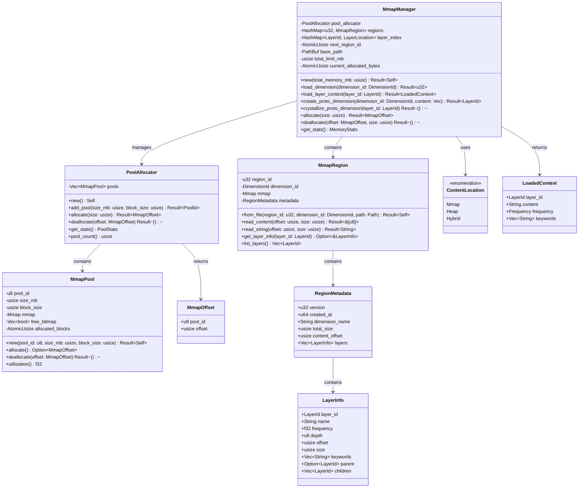
```mermaid
classDiagram
    class MmapManager {
        -PoolAllocator pool_allocator
        -HashMap~u32, MmapRegion~ regions
        -HashMap~LayerId, LayerLocation~ layer_index
        -AtomicUsize next_region_id
        -PathBuf base_path
        -usize total_limit_mb
        -AtomicUsize current_allocated_bytes
        +new(total_memory_mb: usize) Result~Self~
        +load_dimension(dimension_id: DimensionId) Result~u32~
        +load_layer_context(layer_id: LayerId) Result~LoadedContext~
        +create_proto_dimension(dimension_id: DimensionId, content: Vec) Result~LayerId~
        +crystallize_proto_dimension(layer_id: LayerId) Result~()~
        +allocate(size: usize) Result~MmapOffset~
        +deallocate(offset: MmapOffset, size: usize) Result~()~
        +get_stats() MemoryStats
    }

    class PoolAllocator {
        -Vec~MmapPool~ pools
        +new() Self
        +add_pool(size_mb: usize, block_size: usize) Result~PoolId~
        +allocate(size: usize) Result~MmapOffset~
        +deallocate(offset: MmapOffset) Result~()~
        +get_stats() PoolStats
        +pool_count() usize
    }

    class MmapPool {
        -u8 pool_id
        -usize size_mb
        -usize block_size
        -Mmap mmap
        -Vec~bool~ free_bitmap
        -AtomicUsize allocated_blocks
        +new(pool_id: u8, size_mb: usize, block_size: usize) Result~Self~
        +allocate() Option~MmapOffset~
        +deallocate(offset: MmapOffset) Result~()~
        +utilization() f32
    }

    class MmapRegion {
        -u32 region_id
        -DimensionId dimension_id
        -Mmap mmap
        -RegionMetadata metadata
        +from_file(region_id: u32, dimension_id: DimensionId, path: Path) Result~Self~
        +read_content(offset: usize, size: usize) Result~&[u8]~
        +read_string(offset: usize, size: usize) Result~String~
        +get_layer_info(layer_id: LayerId) Option~&LayerInfo~
        +list_layers() Vec~LayerId~
    }

    class RegionMetadata {
        +u32 version
        +u64 created_at
        +String dimension_name
        +usize total_size
        +usize content_offset
        +Vec~LayerInfo~ layers
    }

    class LayerInfo {
        +LayerId layer_id
        +String name
        +f32 frequency
        +u8 depth
        +usize offset
        +usize size
        +Vec~String~ keywords
        +Option~LayerId~ parent
        +Vec~LayerId~ children
    }

    class ContentLocation {
        <<enumeration>>
        Mmap
        Heap
        Hybrid
    }

    class MmapOffset {
        +u8 pool_id
        +usize offset
    }

    class LoadedContext {
        +LayerId layer_id
        +String content
        +Frequency frequency
        +Vec~String~ keywords
    }

    MmapManager --> PoolAllocator : manages
    MmapManager --> MmapRegion : contains
    MmapManager --> ContentLocation : uses
    PoolAllocator --> MmapPool : contains
    MmapRegion --> RegionMetadata : contains
    RegionMetadata --> LayerInfo : contains
    MmapManager --> LoadedContext : returns
    PoolAllocator --> MmapOffset : returns
```

---

## 2. Component Diagram

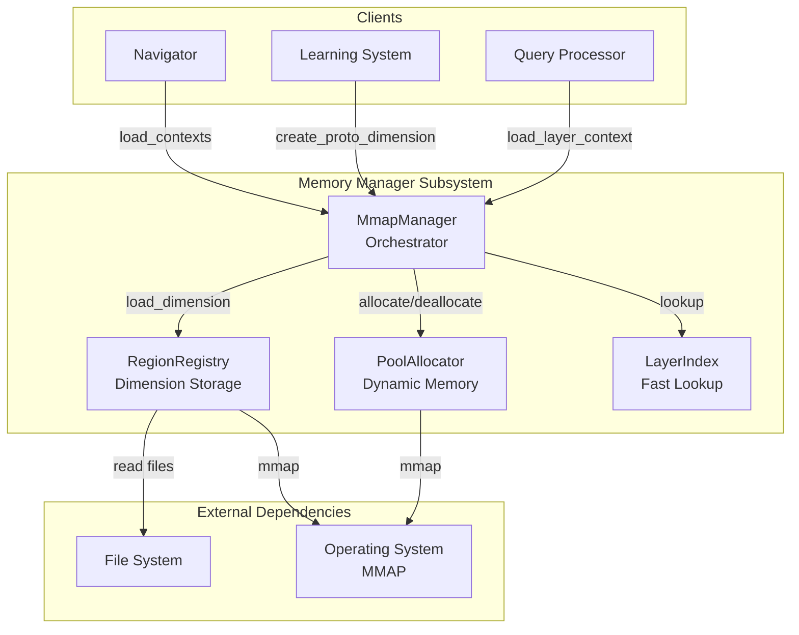
```mermaid
graph TB
    subgraph "Memory Manager Subsystem"
        MM[MmapManager<br/>Orchestrator]
        PA[PoolAllocator<br/>Dynamic Memory]
        RR[RegionRegistry<br/>Dimension Storage]
        LI[LayerIndex<br/>Fast Lookup]
    end

    subgraph "External Dependencies"
        FS[File System]
        OS[Operating System<br/>MMAP]
    end

    subgraph "Clients"
        QP[Query Processor]
        LS[Learning System]
        NAV[Navigator]
    end

    QP -->|load_layer_context| MM
    LS -->|create_proto_dimension| MM
    NAV -->|load_contexts| MM
    
    MM -->|allocate/deallocate| PA
    MM -->|load_dimension| RR
    MM -->|lookup| LI
    
    RR -->|read files| FS
    PA -->|mmap| OS
    RR -->|mmap| OS
```

---

## 3. Sequence Diagrams

### 3.1 Dimension Loading Sequence

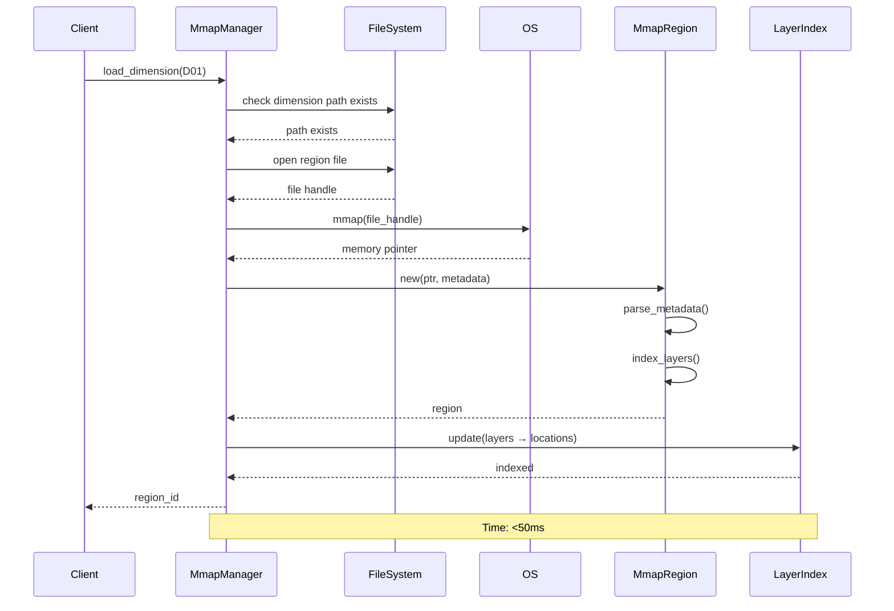
```mermaid
sequenceDiagram
    participant Client
    participant MmapManager
    participant FileSystem
    participant OS
    participant MmapRegion
    participant LayerIndex

    Client->>MmapManager: load_dimension(D01)
    MmapManager->>FileSystem: check dimension path exists
    FileSystem-->>MmapManager: path exists
    MmapManager->>FileSystem: open region file
    FileSystem-->>MmapManager: file handle
    MmapManager->>OS: mmap(file_handle)
    OS-->>MmapManager: memory pointer
    MmapManager->>MmapRegion: new(ptr, metadata)
    MmapRegion->>MmapRegion: parse_metadata()
    MmapRegion->>MmapRegion: index_layers()
    MmapRegion-->>MmapManager: region
    MmapManager->>LayerIndex: update(layers → locations)
    LayerIndex-->>MmapManager: indexed
    MmapManager-->>Client: region_id
    
    Note over MmapManager,LayerIndex: Time: <50ms
```

### 3.2 Layer Access Sequence (Zero-Copy)

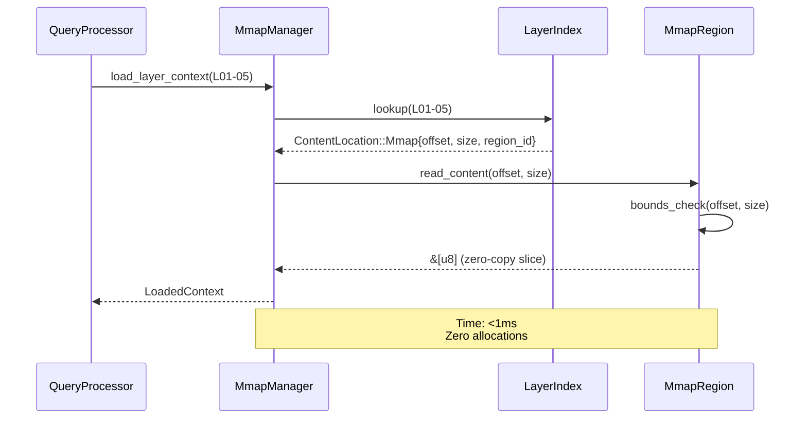
```mermaid
sequenceDiagram
    participant QueryProcessor
    participant MmapManager
    participant LayerIndex
    participant MmapRegion

    QueryProcessor->>MmapManager: load_layer_context(L01-05)
    MmapManager->>LayerIndex: lookup(L01-05)
    LayerIndex-->>MmapManager: ContentLocation::Mmap{offset, size, region_id}
    MmapManager->>MmapRegion: read_content(offset, size)
    MmapRegion->>MmapRegion: bounds_check(offset, size)
    MmapRegion-->>MmapManager: &[u8] (zero-copy slice)
    MmapManager-->>QueryProcessor: LoadedContext
    
    Note over MmapManager,MmapRegion: Time: <1ms<br/>Zero allocations
```

### 3.3 Proto-Dimension Lifecycle

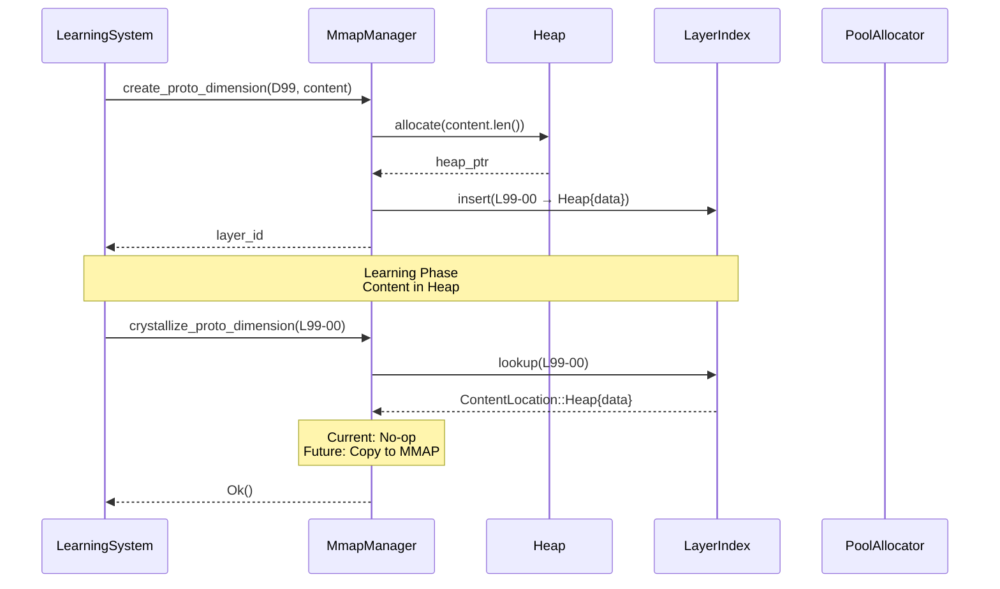
```mermaid
sequenceDiagram
    participant LearningSystem
    participant MmapManager
    participant Heap
    participant LayerIndex
    participant PoolAllocator

    LearningSystem->>MmapManager: create_proto_dimension(D99, content)
    MmapManager->>Heap: allocate(content.len())
    Heap-->>MmapManager: heap_ptr
    MmapManager->>LayerIndex: insert(L99-00 → Heap{data})
    MmapManager-->>LearningSystem: layer_id

    Note over LearningSystem,LayerIndex: Learning Phase<br/>Content in Heap

    LearningSystem->>MmapManager: crystallize_proto_dimension(L99-00)
    MmapManager->>LayerIndex: lookup(L99-00)
    LayerIndex-->>MmapManager: ContentLocation::Heap{data}
    
    Note over MmapManager: Current: No-op<br/>Future: Copy to MMAP
    
    MmapManager-->>LearningSystem: Ok()
```

### 3.4 Concurrent Access Pattern

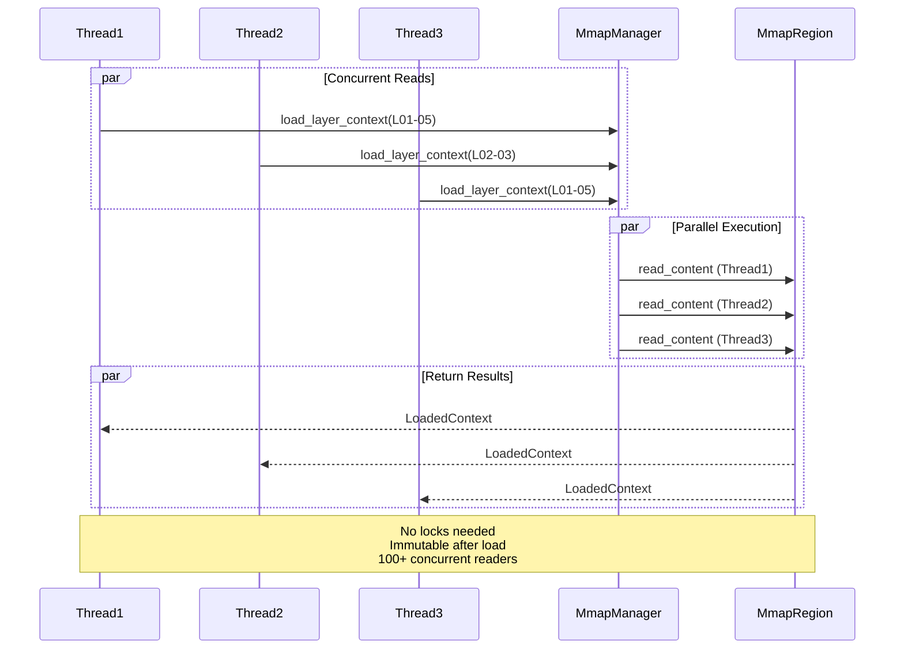
```mermaid
sequenceDiagram
    participant Thread1
    participant Thread2
    participant Thread3
    participant MmapManager
    participant MmapRegion

    par Concurrent Reads
        Thread1->>MmapManager: load_layer_context(L01-05)
        Thread2->>MmapManager: load_layer_context(L02-03)
        Thread3->>MmapManager: load_layer_context(L01-05)
    end

    par Parallel Execution
        MmapManager->>MmapRegion: read_content (Thread1)
        MmapManager->>MmapRegion: read_content (Thread2)
        MmapManager->>MmapRegion: read_content (Thread3)
    end

    par Return Results
        MmapRegion-->>Thread1: LoadedContext
        MmapRegion-->>Thread2: LoadedContext
        MmapRegion-->>Thread3: LoadedContext
    end

    Note over Thread1,MmapRegion: No locks needed<br/>Immutable after load<br/>100+ concurrent readers
```

---

## 4. State Machine Diagrams

### 4.1 Proto-Dimension Lifecycle State Machine

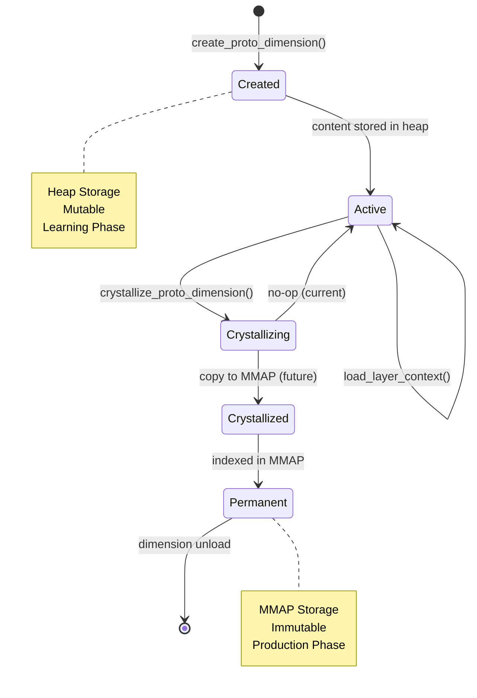
```mermaid
stateDiagram-v2
    [*] --> Created: create_proto_dimension()
    Created --> Active: content stored in heap
    Active --> Active: load_layer_context()
    Active --> Crystallizing: crystallize_proto_dimension()
    Crystallizing --> Crystallized: copy to MMAP (future)
    Crystallizing --> Active: no-op (current)
    Crystallized --> Permanent: indexed in MMAP
    Permanent --> [*]: dimension unload
    
    note right of Created
        Heap Storage
        Mutable
        Learning Phase
    end note
    
    note right of Permanent
        MMAP Storage
        Immutable
        Production Phase
    end note
```

### 4.2 Region Loading State Machine

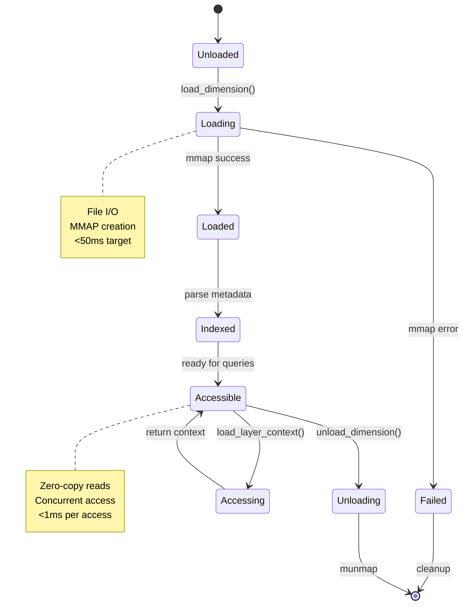
```mermaid
stateDiagram-v2
    [*] --> Unloaded
    Unloaded --> Loading: load_dimension()
    Loading --> Loaded: mmap success
    Loading --> Failed: mmap error
    Failed --> [*]: cleanup
    Loaded --> Indexed: parse metadata
    Indexed --> Accessible: ready for queries
    Accessible --> Accessing: load_layer_context()
    Accessing --> Accessible: return context
    Accessible --> Unloading: unload_dimension()
    Unloading --> [*]: munmap
    
    note right of Loading
        File I/O
        MMAP creation
        <50ms target
    end note
    
    note right of Accessible
        Zero-copy reads
        Concurrent access
        <1ms per access
    end note
```

### 4.3 Memory Allocation State Machine

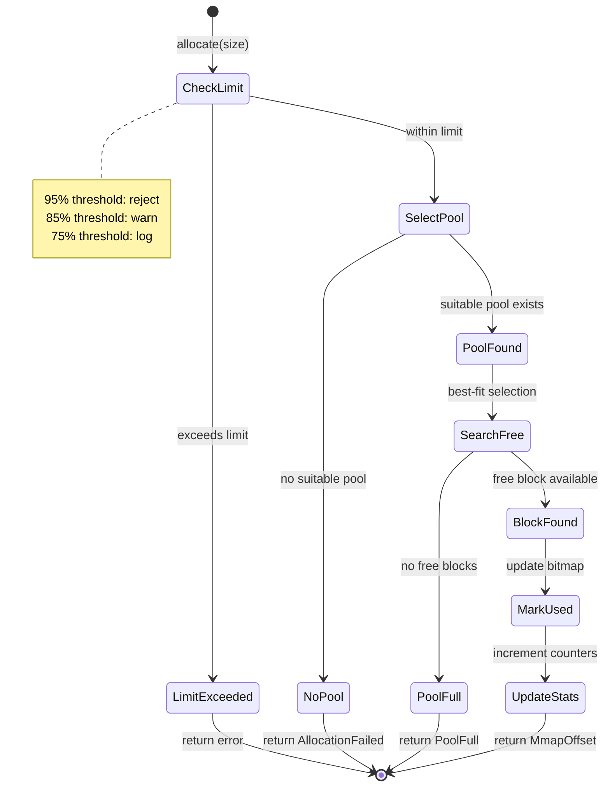
```mermaid
stateDiagram-v2
    [*] --> CheckLimit: allocate(size)
    CheckLimit --> SelectPool: within limit
    CheckLimit --> LimitExceeded: exceeds limit
    LimitExceeded --> [*]: return error
    
    SelectPool --> PoolFound: suitable pool exists
    SelectPool --> NoPool: no suitable pool
    NoPool --> [*]: return AllocationFailed
    
    PoolFound --> SearchFree: best-fit selection
    SearchFree --> BlockFound: free block available
    SearchFree --> PoolFull: no free blocks
    PoolFull --> [*]: return PoolFull
    
    BlockFound --> MarkUsed: update bitmap
    MarkUsed --> UpdateStats: increment counters
    UpdateStats --> [*]: return MmapOffset
    
    note right of CheckLimit
        95% threshold: reject
        85% threshold: warn
        75% threshold: log
    end note
```

---

## 5. Activity Diagrams

### 5.1 Dimension Loading Activity

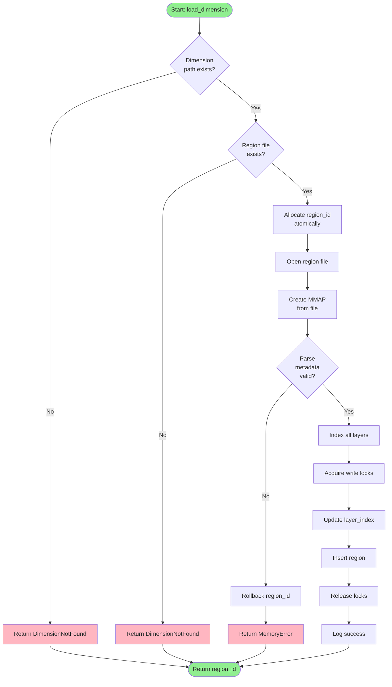
```mermaid
flowchart TD
    Start([Start: load_dimension]) --> CheckPath{Dimension<br/>path exists?}
    CheckPath -->|No| ReturnError1[Return DimensionNotFound]
    CheckPath -->|Yes| CheckFile{Region file<br/>exists?}
    CheckFile -->|No| ReturnError2[Return DimensionNotFound]
    CheckFile -->|Yes| AllocRegionId[Allocate region_id<br/>atomically]
    
    AllocRegionId --> OpenFile[Open region file]
    OpenFile --> CreateMmap[Create MMAP<br/>from file]
    CreateMmap --> ParseMeta{Parse<br/>metadata<br/>valid?}
    
    ParseMeta -->|No| Rollback1[Rollback region_id]
    Rollback1 --> ReturnError3[Return MemoryError]
    
    ParseMeta -->|Yes| IndexLayers[Index all layers]
    IndexLayers --> AcquireLock[Acquire write locks]
    AcquireLock --> UpdateIndex[Update layer_index]
    UpdateIndex --> InsertRegion[Insert region]
    InsertRegion --> ReleaseLock[Release locks]
    ReleaseLock --> LogSuccess[Log success]
    LogSuccess --> End([Return region_id])
    
    ReturnError1 --> End
    ReturnError2 --> End
    ReturnError3 --> End
    
    style Start fill:#90EE90
    style End fill:#90EE90
    style ReturnError1 fill:#FFB6C1
    style ReturnError2 fill:#FFB6C1
    style ReturnError3 fill:#FFB6C1
```

### 5.2 Memory Allocation Activity

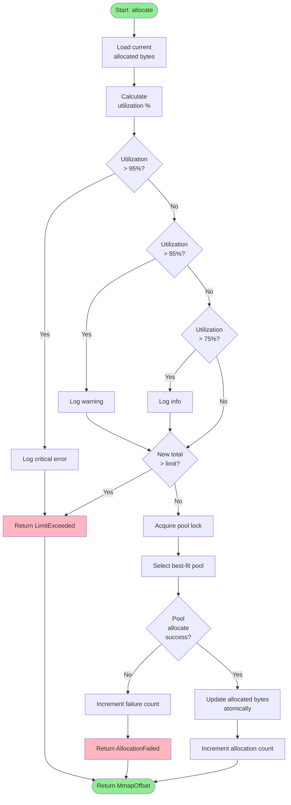
```mermaid
flowchart TD
    Start([Start: allocate]) --> LoadCurrent[Load current<br/>allocated bytes]
    LoadCurrent --> CalcUtil[Calculate<br/>utilization %]
    CalcUtil --> Check95{Utilization<br/>> 95%?}
    
    Check95 -->|Yes| LogCritical[Log critical error]
    LogCritical --> ReturnLimit[Return LimitExceeded]
    
    Check95 -->|No| Check85{Utilization<br/>> 85%?}
    Check85 -->|Yes| LogWarn[Log warning]
    Check85 -->|No| Check75{Utilization<br/>> 75%?}
    Check75 -->|Yes| LogInfo[Log info]
    Check75 -->|No| CheckTotal{New total<br/>> limit?}
    
    LogWarn --> CheckTotal
    LogInfo --> CheckTotal
    
    CheckTotal -->|Yes| ReturnLimit
    CheckTotal -->|No| AcquireLock[Acquire pool lock]
    
    AcquireLock --> SelectPool[Select best-fit pool]
    SelectPool --> PoolAlloc{Pool<br/>allocate<br/>success?}
    
    PoolAlloc -->|No| IncFailCount[Increment failure count]
    IncFailCount --> ReturnFailed[Return AllocationFailed]
    
    PoolAlloc -->|Yes| UpdateBytes[Update allocated bytes<br/>atomically]
    UpdateBytes --> IncAllocCount[Increment allocation count]
    IncAllocCount --> End([Return MmapOffset])
    
    ReturnLimit --> End
    ReturnFailed --> End
    
    style Start fill:#90EE90
    style End fill:#90EE90
    style ReturnLimit fill:#FFB6C1
    style ReturnFailed fill:#FFB6C1
```

---

## 6. Deployment Diagram

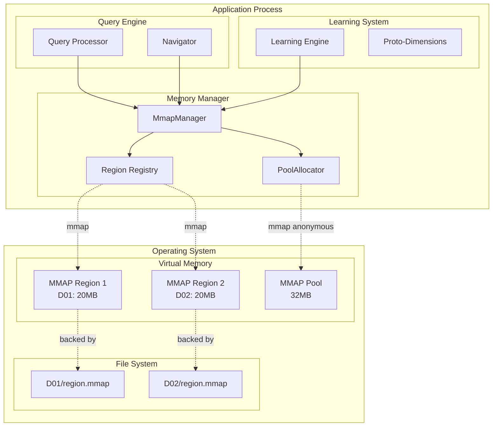
```mermaid
graph TB
    subgraph "Application Process"
        subgraph "Memory Manager"
            MM[MmapManager]
            PA[PoolAllocator]
            RR[Region Registry]
        end
        
        subgraph "Query Engine"
            QP[Query Processor]
            NAV[Navigator]
        end
        
        subgraph "Learning System"
            LS[Learning Engine]
            PD[Proto-Dimensions]
        end
    end
    
    subgraph "Operating System"
        subgraph "Virtual Memory"
            MMAP1[MMAP Region 1<br/>D01: 20MB]
            MMAP2[MMAP Region 2<br/>D02: 20MB]
            MMAP3[MMAP Pool<br/>32MB]
        end
        
        subgraph "File System"
            F1[D01/region.mmap]
            F2[D02/region.mmap]
        end
    end
    
    QP --> MM
    NAV --> MM
    LS --> MM
    
    MM --> PA
    MM --> RR
    
    RR -.->|mmap| MMAP1
    RR -.->|mmap| MMAP2
    PA -.->|mmap anonymous| MMAP3
    
    MMAP1 -.->|backed by| F1
    MMAP2 -.->|backed by| F2
```

---

## 7. Package Diagram

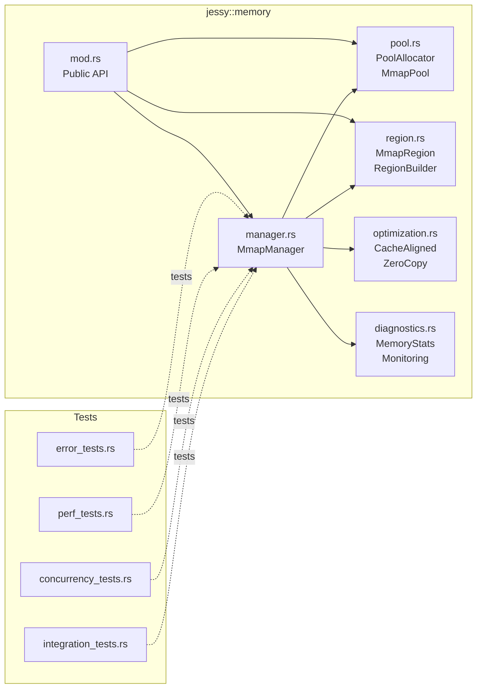
```mermaid
graph LR
    subgraph "jessy::memory"
        MM[manager.rs<br/>MmapManager]
        POOL[pool.rs<br/>PoolAllocator<br/>MmapPool]
        REGION[region.rs<br/>MmapRegion<br/>RegionBuilder]
        OPT[optimization.rs<br/>CacheAligned<br/>ZeroCopy]
        DIAG[diagnostics.rs<br/>MemoryStats<br/>Monitoring]
        MOD[mod.rs<br/>Public API]
    end
    
    subgraph "Tests"
        ERROR[error_tests.rs]
        PERF[perf_tests.rs]
        CONC[concurrency_tests.rs]
        INTEG[integration_tests.rs]
    end
    
    MOD --> MM
    MOD --> POOL
    MOD --> REGION
    
    MM --> POOL
    MM --> REGION
    MM --> OPT
    MM --> DIAG
    
    ERROR -.->|tests| MM
    PERF -.->|tests| MM
    CONC -.->|tests| MM
    INTEG -.->|tests| MM
```

---

## 8. Timing Diagram

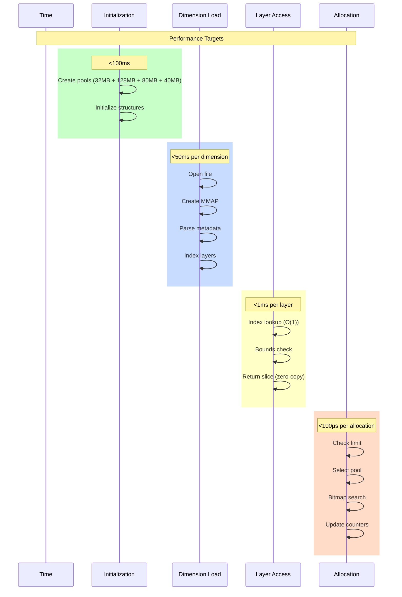
```mermaid
sequenceDiagram
    participant T as Time
    participant Init as Initialization
    participant Load as Dimension Load
    participant Access as Layer Access
    participant Alloc as Allocation

    Note over T,Alloc: Performance Targets
    
    rect rgb(200, 255, 200)
        Note over Init: <100ms
        Init->>Init: Create pools (32MB + 128MB + 80MB + 40MB)
        Init->>Init: Initialize structures
    end
    
    rect rgb(200, 220, 255)
        Note over Load: <50ms per dimension
        Load->>Load: Open file
        Load->>Load: Create MMAP
        Load->>Load: Parse metadata
        Load->>Load: Index layers
    end
    
    rect rgb(255, 255, 200)
        Note over Access: <1ms per layer
        Access->>Access: Index lookup (O(1))
        Access->>Access: Bounds check
        Access->>Access: Return slice (zero-copy)
    end
    
    rect rgb(255, 220, 200)
        Note over Alloc: <100μs per allocation
        Alloc->>Alloc: Check limit
        Alloc->>Alloc: Select pool
        Alloc->>Alloc: Bitmap search
        Alloc->>Alloc: Update counters
    end
```

---

## 9. Data Flow Diagram

```mermaid
flowchart LR
    subgraph "Input"
        QR[Query Request]
        DID[Dimension ID]
        LID[Layer ID]
    end
    
    subgraph "Memory Manager"
        LI[Layer Index<br/>HashMap]
        RR[Region Registry<br/>HashMap]
        PA[Pool Allocator<br/>Vec of Pools]
    end
    
    subgraph "Storage"
        MMAP[MMAP Regions<br/>File-backed]
        HEAP[Heap Storage<br/>Proto-dimensions]
        POOL[Pool Storage<br/>Anonymous MMAP]
    end
    
    subgraph "Output"
        CTX[Loaded Context<br/>Zero-copy]
        ERR[Error with Context]
    end
    
    QR --> LID
    LID --> LI
    LI -->|ContentLocation| RR
    LI -->|ContentLocation| HEAP
    LI -->|ContentLocation| POOL
    
    RR --> MMAP
    MMAP -->|&[u8]| CTX
    HEAP -->|Vec<u8>| CTX
    POOL -->|&[u8]| CTX
    
    DID --> RR
    RR -->|Not Found| ERR
    LI -->|Not Found| ERR
    PA -->|Allocation Failed| ERR
```

---

## 10. Architecture Layers

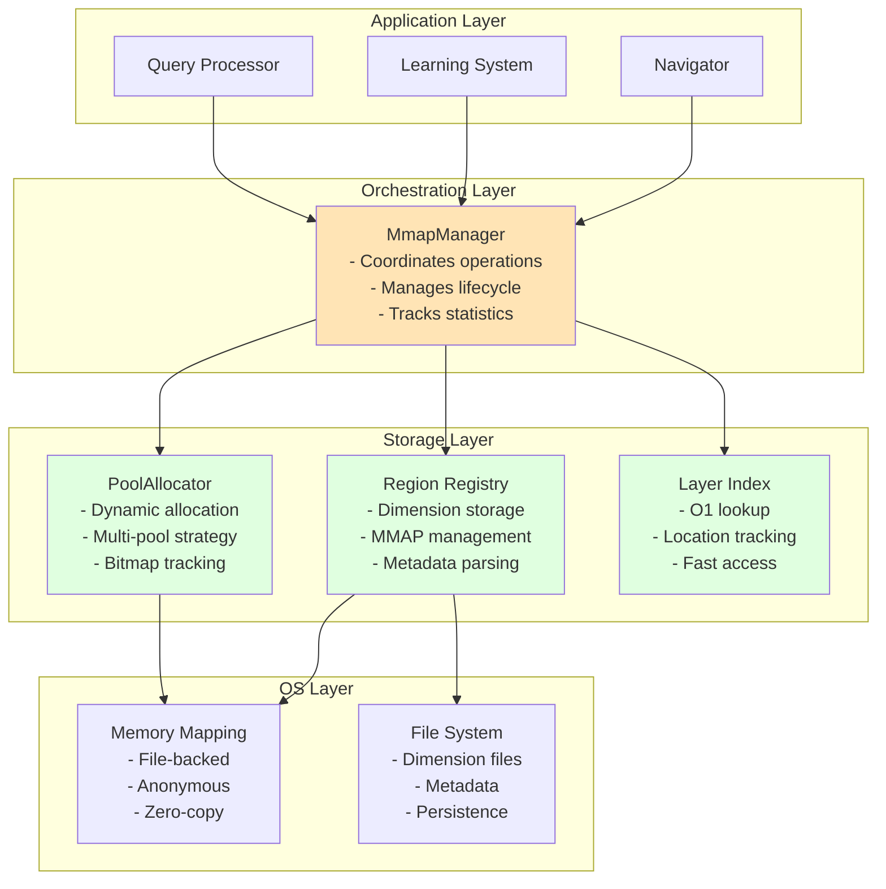
```mermaid
graph TB
    subgraph "Application Layer"
        QP[Query Processor]
        LS[Learning System]
        NAV[Navigator]
    end
    
    subgraph "Orchestration Layer"
        MM[MmapManager<br/>- Coordinates operations<br/>- Manages lifecycle<br/>- Tracks statistics]
    end
    
    subgraph "Storage Layer"
        PA[PoolAllocator<br/>- Dynamic allocation<br/>- Multi-pool strategy<br/>- Bitmap tracking]
        RR[Region Registry<br/>- Dimension storage<br/>- MMAP management<br/>- Metadata parsing]
        LI[Layer Index<br/>- O1 lookup<br/>- Location tracking<br/>- Fast access]
    end
    
    subgraph "OS Layer"
        MMAP[Memory Mapping<br/>- File-backed<br/>- Anonymous<br/>- Zero-copy]
        FS[File System<br/>- Dimension files<br/>- Metadata<br/>- Persistence]
    end
    
    QP --> MM
    LS --> MM
    NAV --> MM
    
    MM --> PA
    MM --> RR
    MM --> LI
    
    PA --> MMAP
    RR --> MMAP
    RR --> FS
    
    style MM fill:#FFE4B5
    style PA fill:#E0FFE0
    style RR fill:#E0FFE0
    style LI fill:#E0FFE0
```

---

## Summary

This architecture document provides comprehensive UML diagrams covering:

1. **Class Diagram**: Core components and relationships
2. **Component Diagram**: High-level system structure
3. **Sequence Diagrams**: Key interaction flows
4. **State Machines**: Lifecycle management
5. **Activity Diagrams**: Process flows
6. **Deployment Diagram**: Runtime organization
7. **Package Diagram**: Code organization
8. **Timing Diagram**: Performance characteristics
9. **Data Flow Diagram**: Information flow
10. **Architecture Layers**: System layers

All diagrams use Mermaid syntax for easy rendering in Markdown viewers and documentation platforms.
