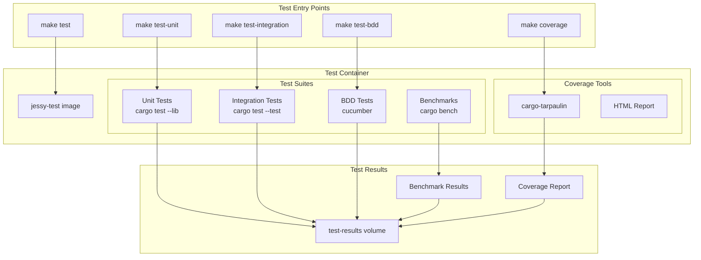

# Architecture Diagrams

## Overview

This document provides visual representations of Jessy's architecture, including service topology, data flows, CI/CD pipelines, and deployment architecture.

---

## Service Architecture

### High-Level System Architecture


### Container Dependency Graph


### Service Communication Flow


---

## Data Flow Architecture

### Dimensional Layer Data Flow


### Memory Management Flow


---

## CI/CD Pipeline Architecture

### Complete CI/CD Flow


### CI Workflow Detail


### Deployment Pipeline


---

## Network Topology

### Docker Network Architecture


### Service Discovery


---

## Volume Architecture

### Volume Hierarchy


### Volume Mount Strategy

```mermaid
graph LR
    subgraph "Host Filesystem"
        SrcDir[./src]
        APIDir[./api]
        CargoToml[./Cargo.toml]
    end
    
    subgraph "Container Filesystem"
        AppSrc[/app/src]
        AppAPI[/app/api]
        AppCargo[/app/Cargo.toml]
        
        subgraph "Named Volumes"
            CargoCacheVol[/usr/local/cargo/registry]
            TargetVol[/app/target]
        end
    end
    
    SrcDir -.->|bind mount| AppSrc
    APIDir -.->|bind mount| AppAPI
    CargoToml -.->|bind mount| AppCargo
    
    CargoCacheVol -.->|named volume| TargetVol
    
    style SrcDir fill:#e1f5ff
    style APIDir fill:#e1f5ff
    style CargoToml fill:#e1f5ff
    style CargoCacheVol fill:#fff4e1
    style TargetVol fill:#fff4e1
```

---

## Build Architecture

### Multi-Stage Docker Build


### Build Cache Strategy


---

## Testing Architecture

### Test Execution Flow




### Test Isolation Strategy


---

## Health Check Architecture

### Health Check Flow


### Service Startup Sequence


---

## Hot Reload Architecture

### Development Hot Reload Flow


### Hot Reload Timing


---

## Deployment Architecture

### Production Deployment

```mermaid
graph TB
    subgraph "GitHub"
        Tag[Version Tag<br/>v1.2.3]
        Actions[GitHub Actions]
        Registry[GitHub Container Registry]
    end
    
    subgraph "Build Pipeline"
        Build[Build Multi-arch Images]
        Test[Run Test Suite]
        Scan[Security Scan]
        Push[Push to Registry]
    end
    
    subgraph "Production Environment"
        LB[Load Balancer]
        
        subgraph "Instance 1"
            Core1[jessy-core]
            API1[jessy-api]
        end
        
        subgraph "Instance 2"
            Core2[jessy-core]
            API2[jessy-api]
        end
        
        Storage[Persistent Storage]
    end
    
    Tag --> Actions
    Actions --> Build
    Build --> Test
    Test --> Scan
    Scan --> Push
    Push --> Registry
    
    Registry --> Core1
    Registry --> API1
    Registry --> Core2
    Registry --> API2
    
    LB --> API1
    LB --> API2
    
    API1 --> Core1
    API2 --> Core2
    
    Core1 --> Storage
    Core2 --> Storage
```


### Blue-Green Deployment Strategy

```mermaid
graph TB
    subgraph "Load Balancer"
        LB[Traffic Router]
    end
    
    subgraph "Blue Environment (Current)"
        BlueAPI[jessy-api v1.2.2]
        BlueCore[jessy-core v1.2.2]
    end
    
    subgraph "Green Environment (New)"
        GreenAPI[jessy-api v1.2.3]
        GreenCore[jessy-core v1.2.3]
    end
    
    subgraph "Shared Resources"
        DB[(Database)]
        Storage[(Storage)]
    end
    
    LB -->|100% traffic| BlueAPI
    LB -.->|0% traffic| GreenAPI
    
    BlueAPI --> BlueCore
    GreenAPI --> GreenCore
    
    BlueCore --> DB
    GreenCore --> DB
    BlueCore --> Storage
    GreenCore --> Storage
    
    style BlueAPI fill:#87CEEB
    style BlueCore fill:#87CEEB
    style GreenAPI fill:#90EE90
    style GreenCore fill:#90EE90
```

---

## Security Architecture

### Security Layers

```mermaid
graph TB
    subgraph "External Layer"
        Internet[Internet]
        Firewall[Firewall]
    end
    
    subgraph "Network Layer"
        LB[Load Balancer<br/>TLS Termination]
        WAF[Web Application Firewall]
    end
    
    subgraph "Application Layer"
        API[jessy-api<br/>Input Validation]
        Auth[Authentication]
        RateLimit[Rate Limiting]
    end
    
    subgraph "Service Layer"
        Core[jessy-core<br/>Business Logic]
        Validation[Data Validation]
    end
    
    subgraph "Data Layer"
        MMAP[MMAP Files<br/>Read-only]
        Secrets[Secrets Manager]
    end
    
    Internet --> Firewall
    Firewall --> LB
    LB --> WAF
    WAF --> API
    API --> Auth
    Auth --> RateLimit
    RateLimit --> Core
    Core --> Validation
    Validation --> MMAP
    API -.->|fetch| Secrets
    Core -.->|fetch| Secrets
```


### Container Security Model

```mermaid
graph TB
    subgraph "Host OS"
        Kernel[Linux Kernel]
        
        subgraph "Namespaces"
            PID[PID Namespace]
            NET[Network Namespace]
            MNT[Mount Namespace]
            USER[User Namespace]
        end
        
        subgraph "Control Groups"
            CPU[CPU Limits]
            MEM[Memory Limits]
            IO[I/O Limits]
        end
    end
    
    subgraph "Container"
        App[Application<br/>Non-root user]
        FS[Read-only Filesystem]
        Caps[Dropped Capabilities]
    end
    
    Kernel --> PID
    Kernel --> NET
    Kernel --> MNT
    Kernel --> USER
    
    Kernel --> CPU
    Kernel --> MEM
    Kernel --> IO
    
    PID --> App
    NET --> App
    MNT --> FS
    USER --> App
    
    CPU --> App
    MEM --> App
    IO --> App
    
    App --> Caps
    
    style App fill:#90EE90
    style FS fill:#FFD700
    style Caps fill:#FFD700
```

---

## Monitoring Architecture (Future)

### Observability Stack

```mermaid
graph TB
    subgraph "Application Layer"
        Core[jessy-core]
        API[jessy-api]
    end
    
    subgraph "Metrics Collection"
        Prometheus[Prometheus]
        Exporter1[Rust Metrics Exporter]
        Exporter2[Go Metrics Exporter]
    end
    
    subgraph "Visualization"
        Grafana[Grafana]
        Dashboard1[System Dashboard]
        Dashboard2[Application Dashboard]
    end
    
    subgraph "Tracing"
        Jaeger[Jaeger]
        Collector[Trace Collector]
    end
    
    subgraph "Logging"
        Loki[Loki]
        Aggregator[Log Aggregator]
    end
    
    Core --> Exporter1
    API --> Exporter2
    Exporter1 --> Prometheus
    Exporter2 --> Prometheus
    
    Prometheus --> Grafana
    Grafana --> Dashboard1
    Grafana --> Dashboard2
    
    Core --> Collector
    API --> Collector
    Collector --> Jaeger
    
    Core --> Aggregator
    API --> Aggregator
    Aggregator --> Loki
    Loki --> Grafana
```

---

## Related Documentation

- [Docker Setup](DOCKER_SETUP.md)
- [CI/CD Pipeline](CI_CD.md)
- [Testing Infrastructure](TESTING_INFRASTRUCTURE.md)
- [Troubleshooting Guide](TROUBLESHOOTING.md)

---

*"A picture is worth a thousand words. A diagram is worth a thousand lines of code. 📐"*
